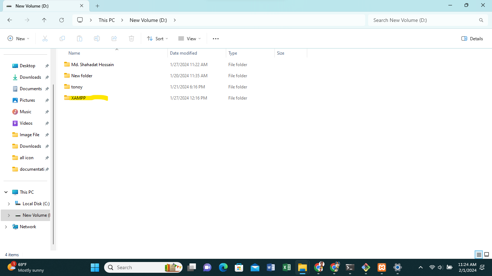
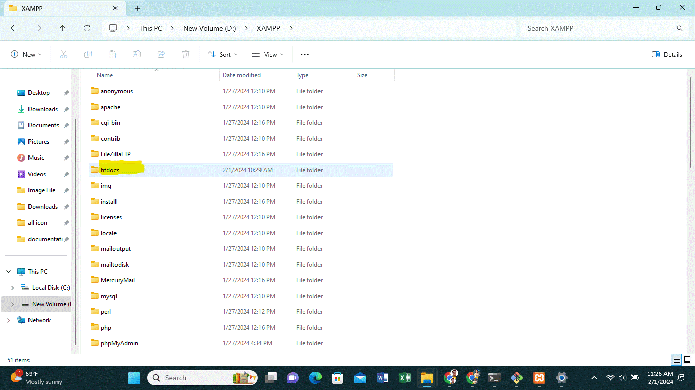
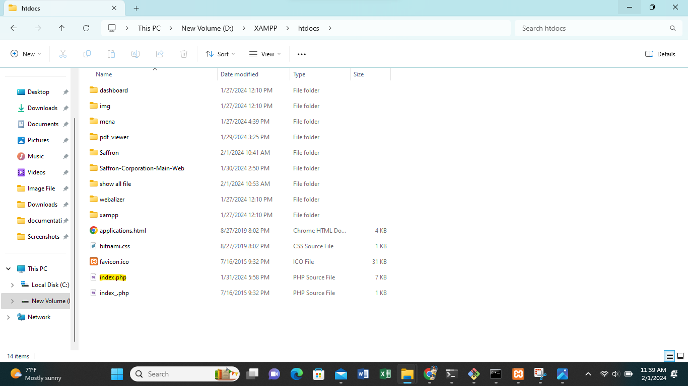

# xampp server index file

This repo helps to show xampp root of all files in live. It's just an index.php file. When you install you need xampp go to file location, and replace the index file.

### stap

1. Go to your xampp
   

2. Go to your htdocs
   

3. replace index.php file. won't remove your real index.php file just change the name.
   

4. start xampp server and go to the browser type just localhost and view your all files.
   

#### If you need help, please[ message me!](https://www.linkedin.com/in/md-shahadat-hossain-b31388245/).
